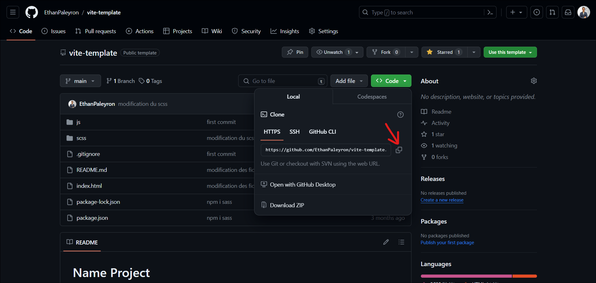

# Monopage

## Use of [Vite](https://vitejs.dev/) and [SCSS](https://sass-lang.com/).

## Install the software :

- The code editor : [Visual Studio Code](https://code.visualstudio.com/).
- Install Vite : [NodeJS](https://nodejs.org/en).
- Install the : [GitBash](https://git-scm.com/downloads).

## Project launch :

### Open `GitBash` or `Terminal`.

### Clone the project `git clone` **(_URL_ of the project)**.



```bash
git clone https://github.com/EthanPaleyron/monopage.git
```

### Enter the project.

```bash
cd monopage
```

### Install the dependencies.

```bash
npm i
```

### Open `Visual Studio Code`.

```bash
code .
```

### Run the development.

```bash
npm run dev
```
